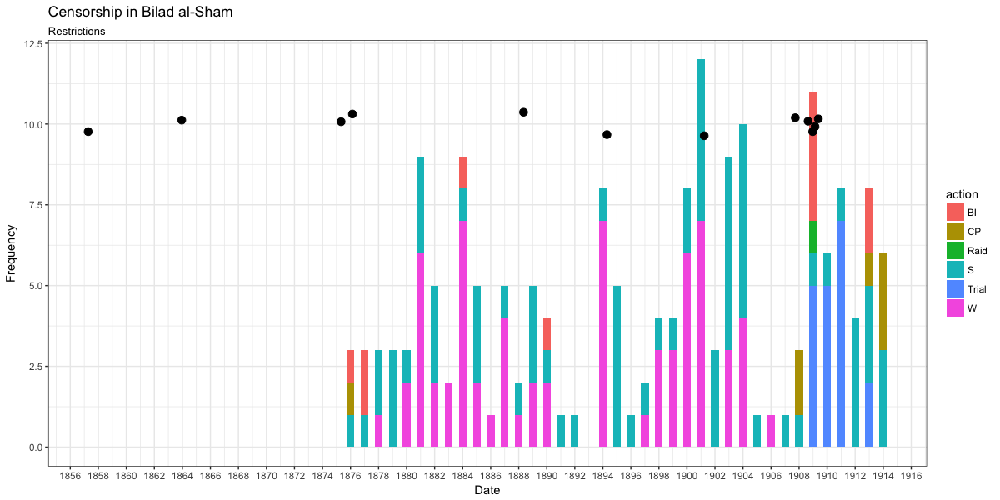

## Authoritarianism versus liberty of speech? The theory and practices of press censorship in *Bilād al-Shām* (1875--1914)
### Till Grallert, Orient-Institut Beirut
### MESA 2017

Slides: [tillgrallert.github.io/slides/2017-mesa](https://tillgrallert.github.io/slides/2017-mesa)

Twitter: @[tillgrallert](https://twitter.com/tillgrallert)

Email: <grallert@orient-institut.org>

# Introduction
## Abstract

- Case study: periodical press of Damascus and Beirut, 1875–1914
<!-- - Background: prevalence of strong views, but lack of empirical studies on the press in *Bilād al-Shām* -->
- Argument: 
    + No dichotomy of Hamidian tyranny vs Young-Turk liberty of speech.
    + Instead: ever-increasing will and capability to effectively control the periodical press as well as a shared belief in the project of modernity among authors, readers, and regulators.

# Practices of censorship
## Statistics

## Conclusion

- no dichotomy of Hamidian tyranny vs Young Turk liberty
- gradual convergence towards effective censorship with the expansion of a modern(ising) state and its institutions.
- importance of the 1894 legislation <!-- coinciding with "effective" censorship in *Bilād al-Shām* -->
- surprising freedoms during Hamidian era
- "re-"introduction of repressive legislation in 1909 and their effective implementation
- continuous importance of limiting factors
- continuous importance of the social consensus within the network of journalists-cum-officials-cum-entrepreneurs