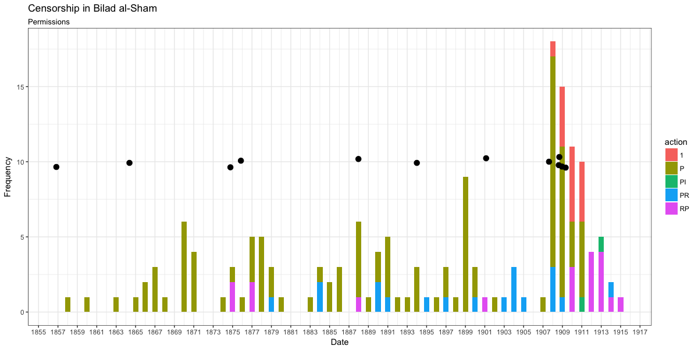
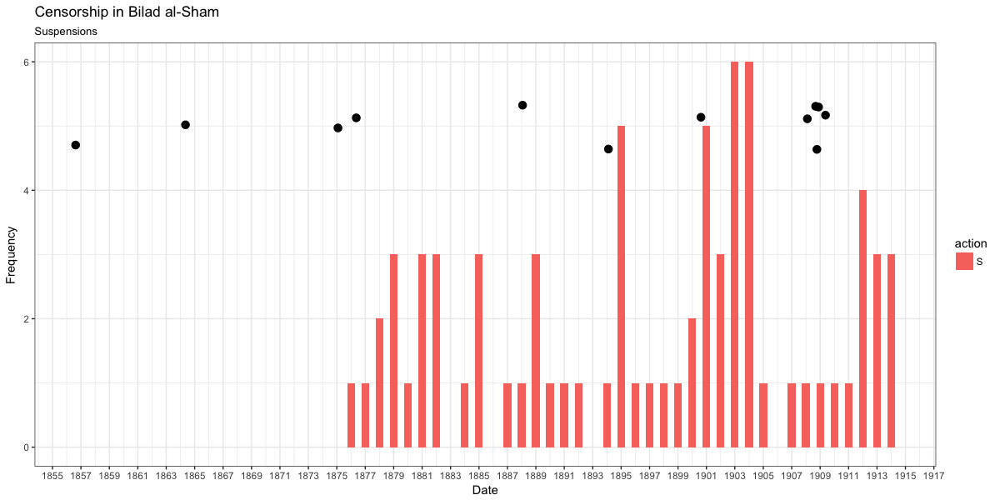
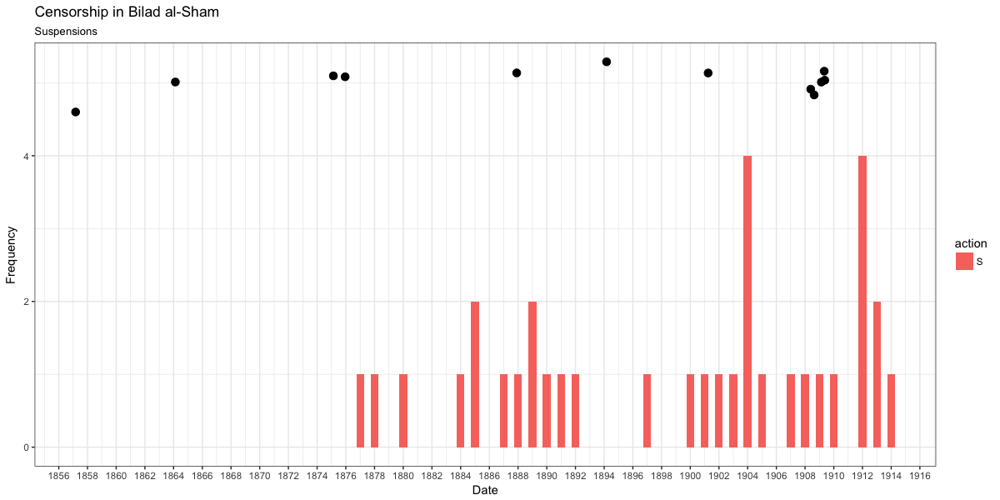

## Authoritarianism versus liberty of speech? The theory and practices of press censorship in *Bilād al-Shām* (1875--1914)
### Till Grallert, Orient-Institut Beirut
### MESA 2017

Slides: [tillgrallert.github.io/slides/2017-mesa](https://tillgrallert.github.io/slides/2017-mesa)

Twitter: @[tillgrallert](https://twitter.com/tillgrallert)

Email: <grallert@orient-institut.org>

# Introduction
## Two opposing views and a cliché

## Abstract

- Case study: periodical press of Damascus and Beirut, 1875–1914
- Sources: legal texts and periodicals 
<!-- - Background: prevalence of strong views, but lack of empirical studies on the press in *Bilād al-Shām* -->
- Question: What were the legal norms,  institutional frameworks, and practices of censorship?
<!-- - Argument:
    1. Three instead of two phases
    2. Reliance a shared belief in the project of modernity -->
<!--     + No dichotomy of Hamidian tyranny vs Young-Turk liberty of speech.
    + Instead: ever-increasing will and capability to effectively control the periodical press as well as a shared belief in the project of modernity among authors, readers, and regulators. -->

## Argument 1

Press censorship evolved in three steps:

1. Establish and reiterate legal norms; 1850s, 1860s
2. Gather information and build institutions capable of enforcing these norms; 1880s, 1890s
3. Start enforcing them once legal norms have indeed become social normality; 1890s and especially 1909 onwards 

## Argument 2

Control of the press depended to a large extent on:

1. A shared belief in the project of modernity that governed the focus of reporting.
2. A tightly knit network of 

## outline

1. Legal/institutional framework
2. Realities of press censorship

# Power of the norm
## Three phases

<!-- the three phases can be observed in theory and praxis -->

## Pre-1876: establishing the norms

### laws

- 1857, Jan: Law on Printing Presses (*maṭbaʿa niẓāmnāmesi*)
   <!--  + permits required for publishers
    + ban on "harmful" (*muẕarr*) publications -->
- **1864, 31 Dec: Law on Printed Material** (*maṭbūʿāt niẓāmnāmesi*)
    <!-- + permits required for periodicals
    + authorities must be supplied with copies *after* publication
    + regulation of permissible content
    + no institutionalised censorship but private litigation in the courts -->
<!-- 1867, Ḳararnāme-yi ʿAlī; {Boyar 2006@421} -->
- 1875, 10 Sep: Supplement to 1864 law
    <!-- + suspensions for false news, stiring the minds of the people (*teḫdīş-i eẕhān*) -->
<!-- - 1876, 12 Apr: decree published in the press; {Boyar 2006@421-422} without source
    + pre-publication censorship of the press -->

### core regulations

- restrictions: permits <!-- required --> for <!-- printing --> presses and periodicals, permissible content
- surveillance: post publication
- enforcement: mostly private litigation in the courts 

## First constitutional period

- 1876, 23 Dec: first Ottoman constitution; abolished on Dec 11, 1879
    + art 12: "the press is free within the confines of the law" (*maṭbūʿāt ḳānūn dāʿiresinde serbesttir*)
    + press laws are **not** abrogated
<!-- - 1880, 19 December -->

## Hamidian period: setting-up the infrastructure

### laws
- 1888, 22 Jan: Law on Printing Presses
- **1894, 20 Nov: Law on Printing Presses**
    <!-- + abrogating the 1857 and 1888 laws
    + permits required for every part of the trade
        * permits continuously supervised by police and Directorate of Public Instruction
    + pre-publication permits required for all publications 
    + every part of the trade is fully liable to prosecution in case of transgressions
        * Police and judiciary tasked with enforcement
    + surveillance and random inspection of presses
    + supplying all relevant information in Ottoman
    + only periodicals' titles are allowed to be publicly announced in the streets -->
- 1901, Dec: *teẕkere* from the Ministry of the Interior
    <!-- + censorship (*murāqaba*) of periodicals is to be centralised at the Directorates of Printed Material (*mudīriye-yi maṭbūʿāt*)
    + all official publications are subjected to the same regime of censorship -->

### core regulations

<!-- - abrogating earlier laws -->
- new restrictions: <!-- pre-publication permits for everything but periodicals,  -->public announcements in the streets are limited to periodical titles
- surveillance: random inspections, all information must be supplied in Ottoman
- liabilities: every part of the trade
- enforcement: police, directorate of public instruction, judiciary

# Second constitutional period
## 1908, the year of liberty?!

### yes

- 1908, 23 Jul: restoration of the constitution
    + Art 12: The press is free within the confines of the law
- 1908, 30 Jul: *ḫaṭṭ-ı hümāyūn* to the Grand Vezier
    + Art 7: Henceforth, newspapers are not subjected to censorship. They can circulate freely. Claims against newspapers can only be decided by courts

### but

- no publisher failed to obtain permits

## Renewed censorship

### laws

- 1909, Mar: *teẕkere* from Ministry of Justice
    <!-- + reminder that the various press laws had not been abolished -->
- 1909, 29 Jul: Law on Printing Presses (*maṭbaʿalar ḳānūnu*)
    <!-- + permits required
    + publications subject to approval by Ministries of the Interior & Education
    + enforced by penal courts and gendarmerie -->
- 1909, 29 Jul: Law on Printed Material (*maṭbūʿāt ḳānūnu*)
    <!-- + abrogating the 1864 law
    + permits required within a month
    + regulation of permissible content
    + all parts of the trade are liable to prosecution as if they were the authors
    + two copies of each issue to be supplied to the authorities
    + enforced by Ministry of the Interior, province, *mutaṣarriflik* -->
- 1909, 21 Aug: amendment to art 12 of the constitution
    <!-- + periodicals cannot in any way be subject to control *before* (!) publication -->
- 1912, 18 Mar: Supplement to the Law on Printed Material
    <!-- + responsible editors must be Ottoman subjects, older than 21, graduates of at least 7 years of ʿidādī education -->

### core regulations

- new restrictions: new permits for existing presses & periodicals,<!-- pre-publication permits, --><!-- , permissible content --> limited to Ottoman graduates of higher education (1912)
- liabilities: every part of the trade, including sellers
- enforcement: Ministries of the Interior and Education, province, *mutaṣarriflik*, police, gendarmerie, judiciary

## A priori censorship?

- required for all non-periodical publications by 1894 and 1909 laws on printing presses
- **not** required for periodical press by 1864 and 1909 laws on printed material
- official attempts at *a priori* censorship are contested by the press in 1912

# Practices of censorship
## Publication statistics: permissions

](../assets/censorship/rplot_levant-permissive.png)

## Post 1909: Quick succession of titles

1. *al-Muqtabas*, Damascus
    + *al-Muqtabas*: 1908, Dec - 1909, Sep
    + **suspended**
    + *al-Umma*: 1910, Jan - 1910, Mar
    + *al-Muqtabas*: 1910, Mar - 1912, Apr
    + **suspended**
    + *al-Muqtabas*: 1912, Aug - 1913, Sep
    + *al-Qabas*: 1913, Sep - 1914, Jan
    + *al-Muqtabas*: 1914, Jan -

2. *al-Mufīd*, Beirut
    + *al-Mufīd*: 1909, Feb
    + *Ṣadā al-Mufīd*: 1912, May
    + *Lisān al-ʿArab* (5 days): 1912, Sep
    + *al-Fatā al-ʿArabī*: 1912, Sep - 1913, Nov
    + *Fatā al-ʿArab*: 1913, Dec - 1914, Jul

## Publication statistics: restrictions

](../assets/censorship/rplot_levant-restrictive.png)

## Publication statistics: suspensions

## Publication statistics: implemented suspensions

## What were the reasons for interventions?

1. ignoring the censor's warning (1890s onwards)
2. publication of false news (mainly 1880s)
3. non-compliance with the press code(s) / principles of censorship (1900s)
4. disturbing public tranquillity and causing anxieties (*takhdīsh al-adhhān*)

<!--  -->

## Permissible content

- "surprising" level and frequency of *out-spoken criticism* 
- critical articles were not limited to the private press
- outright praise beyond the generic eulogies on important occasions was **less common** than criticism
- "embarrassing" news remained unpublished

## Conclusion

- no dichotomy of Hamidian tyranny vs Young Turk liberty
- gradual convergence towards effective censorship with the expansion of a modern(ising) state and its institutions.
- importance of the 1894 legislation <!-- coinciding with "effective" censorship in *Bilād al-Shām* -->
- surprising freedoms during Hamidian era
- "re-"introduction of repressive legislation in 1909 and their effective implementation
- continuous importance of limiting factors
- continuous importance of the social consensus within the network of journalists-cum-officials-cum-entrepreneurs

## Thank you 