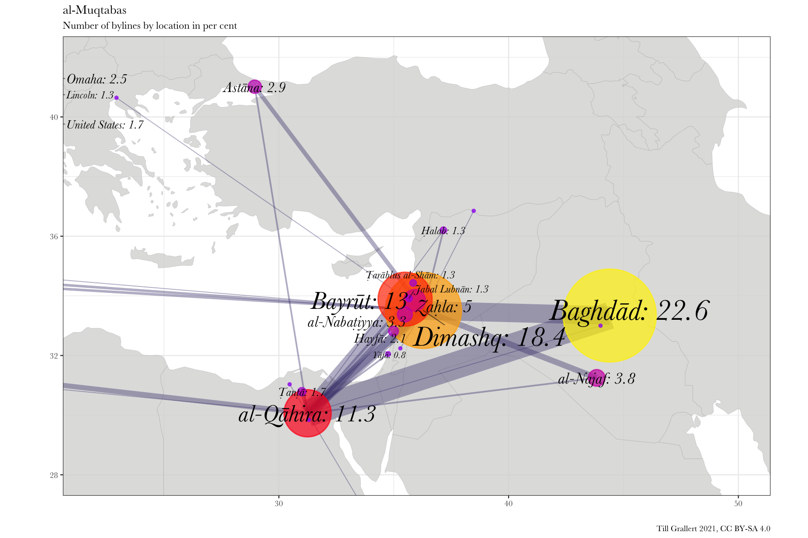
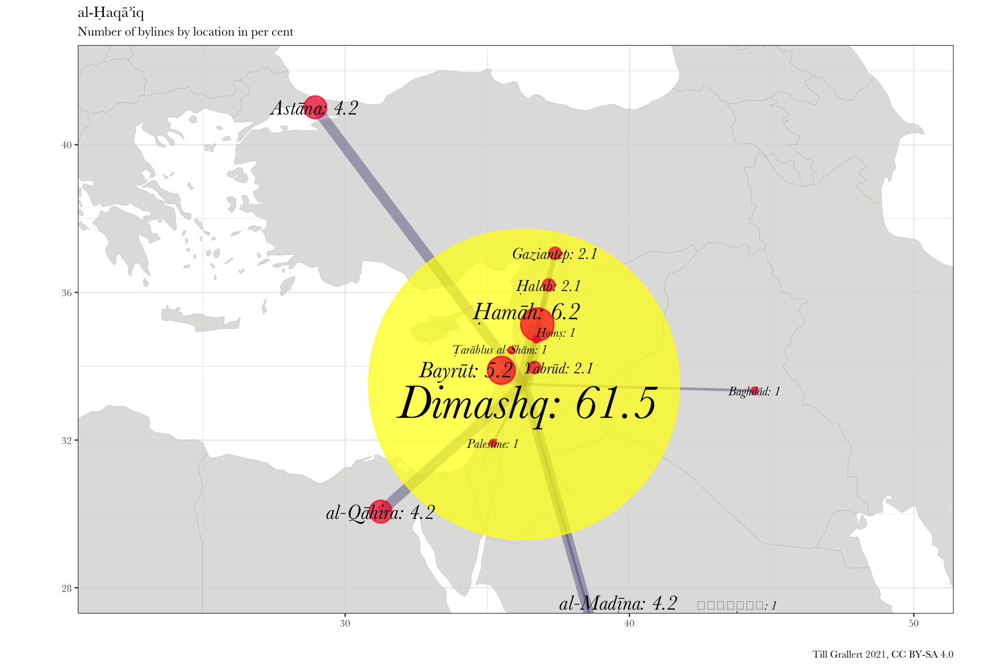

## Title slide

Till Grallert, Orient-Institut Beirut (OIB), @[tillgrallert](https://twitter.com/tillgrallert)

Probevortrag

Slides: [https://tillgrallert.github.io/slides/dh/2021-mind-the-gap](https://tillgrallert.github.io/slides/dh/2021-mind-the-gap/index.html)

## Übersicht des Probevortrages

1. Digitalität als egalitäres Versprechen
2. Digitalität als extreme Ungleichheit
3. Meine Ansätze um diese zu Addressieren
4. Meine analytischen Ansätze

# 1. Digitalität als egalitäres Versprechen
# 2. Digitalität als extreme Ungleichheit
# 3. Meine Ansätze um diese zu Addressieren
# 3.1 Knowledge gap: Project Jarāʾid (2012--)
## [Project Jarāʾid](https://projectjaraid.github.io/)

<!-- - Addressiert den **knowledge gap** mit einer Webseite und offenen Datensätzen (TEI XML). -->

- Bibliographische Erfassung sämtlicher arabischer Periodika seit ihrer Entstehung um 1800 bis 1930.
    + Webseite und offenen Datensätzen (TEI XML)
    + Normdatensätze für c.2700 Personen, 220 Orte, 180 Bibliotheken u.ä.
- Kollaboration mit Adam Mestyan (Duke)

## Project Jarāʾid

:::{.c_width-50 .c_right}
{#fig:jaraid-stats}
:::

:::{.c_width-50 .c.left}

|                  | number  | %     |
| ---------------- | ------: | ----: |
| Periodika        | 3269    |       |
| in Bibliotheken  | 747     | 22.85 |
| digitalisiert    | 145     | 4.44  |

Table: In Project Jarāʾid erfasste Periodika {#tbl:jaraid-stats}
:::

# 3.2 Infrastructural gap: Open Arabic Periodical Editions (OpenArabicPE, 2015--) <!-- digitisation bias  -->
## corpus building: [Open Arabic Periodical Editions](https://openarabicpe.github.io)

1. Ideen:
    - Verbindung **vorhandener** Faksimiles und Transkriptionen in einem standardkonformen, offenen Format
    - Scraping, Erzeugung, Validierung und Teilen von offenen bibliographischen Metadaten
2. Ziele
    + **Validierung** der Transkriptionen
    + Iterative und kollaborative **Verbesserungen** der Editionen
    + Alles soll dauerhaft **zitierbar** und **verlinkbar** sein
    + Verbesserte Zugänglichkeit und Nachnutzung durch **offene Lizenzen**
3. Prinzipien
    - Weiternutzung **vorhandener** und **etablierter** Werkzeuge und Technologien
    - Präferenz für **offene** und **einfache** Formate und Werkzeuge

## corpus building: [Open Arabic Periodical Editions](https://openarabicpe.github.io)

:::{.c_width-60 .c_left}

1. Digitale Editionen: TEI XML.
1. Offene Lizenzen: [CC BY-SA 4.0](http://creativecommons.org/licenses/by-sa/4.0/) (TEI, MODS, BibTeX), MIT license (XSLT, XQuery)
2. Soziale digitale Editionen, die auf [GitHub](https://github.com/openarabicpe) gehostet sind: <!-- gradually improve transcription and mark-up -->
2. Veröffentlichungen werde auf [Zenodo](https://zenodo.org) archiviert: DOI für dauerhafte Referenzierbarkeit
3. [Statische Webansichten](https://github.com/openarabicpe/tei-boilerplate-arabic-editions)<!--  (doesn't require a permanent internet connection) -->: Parallele Darstellung von Text und Faksimile.
4. Bibliographische Metadaten sind als öffentliche [Zotero-Gruppe](https://www.zotero.org/groups/openarabicpe) gehostet

:::
:::{.c_width-30 .c_right}

](../../assets/OpenArabicPE/boilerplate_muqtabas.png)

:::

## OpenArabicPE's corpus

| Periodikum                                                                        | DOI                                                              | Bände | Ausgaben | Artikel | Wörter   | Wörter/Artikel |
| :--------                                                                         | :--                                                              | ----: | ----:    | ----:    | ----:   | ----:             |
| [al-Ḥaqāʾiq](https://www.github.com/openarabicpe/digital-haqaiq)              | [10.5281/zenodo.1232016](https://doi.org/10.5281/zenodo.1232016) | 3     | 35       | 389      | 298090  | 832.66            |
| [al-Ḥasnāʾ](https://www.github.com/openarabicpe/journal_al-hasna)             | [10.5281/zenodo.3556246](https://doi.org/10.5281/zenodo.3556246) | 1     | 12       | 201      | NA      | NA                |
| [al-Manār](https://www.github.com/openarabicpe/journal_al-manar)                  |                                                                  | 35    | 537      | 4300     | 6144593 | 1437.73           |
| [al-Muqtabas](https://www.github.com/tillgrallert/digital-muqtabas)           | [10.5281/zenodo.597319](https://doi.org/10.5281/zenodo.597319)   | 9     | 96       | 2964     | 1981081 | 873.34            |
| [al-Ustādh](https://www.github.com/openarabicpe/journal_al-ustadh)                | [10.5281/zenodo.3581028](https://doi.org/10.5281/zenodo.3581028) | 1     | 42       | 435      | 221447  | 582.21            |
| [al-Zuhūr](https://www.github.com/openarabicpe/journal_al-zuhur)                  | [10.5281/zenodo.3580606](https://doi.org/10.5281/zenodo.3580606) | 4     | 39       | 436      | 292333  | 695.09            |
| [Lughat al-ʿArab](https://www.github.com/openarabicpe/journal_lughat-al-arab) | [10.5281/zenodo.3514384](https://doi.org/10.5281/zenodo.3514384) | 3     | 34       | 939      | 373832  | 485.21            |
| **total**                                                                         |                                                                  | 56    | 795      | 9664     | 9311376 |                   |

Table: Übersicht über das Periodikakorpus {#tbl:openarabicpe-corpus}


# 3.3 Tool gap: OCR/HTR für arabische Periodika (2018--)


## OCR/HTR für arabische Periodika

# 4. Meine analytischen Ansätze
# 4.1 Netzwerkanalyse
# 4.1.1 Evaluierung des Korpus: Netzwerk der erwähnten Periodika
## Netzwerk der erwähnten Periodika: Datenquelle

:::{.c_width-50 .c_left}

- Auszeichnung aller Erwähnungen von Periodika im Text
    + semi-automatisch (regex): folgt dem Muster "Zeitung ABC", "Zeitschrift DEF"
- Normdatensätze für die Disambiguierung und Anreicherung von Daten
    + zumeist automatisch erstellt und verknüpft

:::
:::{.c_width-50 .c_right}
<!-- Zwei Ausschnitte, die verschiedene Periodika mit dem gleichen Titel (*al-Zuhūr*) erwähnen. -->

<!-- ägyptische Zeitschrift -->
```xml
والأصح الدرعية بلام التعريف (راجع <bibl subtype="journal" type="periodical">مجلة <title level="j" ref="oape:bibl:3 oclc:1034545644" xml:id="title_16.d2e2291">الزهور</title> المصرية  <biblScope unit="volume" from="2" to="2">٢</biblScope> :  <biblScope unit="page" from="292">٢٩٢</biblScope></bibl>)
```

<!-- irakische Zeitung -->
```xml
وانتخب <persName>فؤاد أفندي الدفتري البغدادي</persName> و<bibl><editor><persName>نوري أفندي</persName></editor> راس كتاب <textLang otherLangs="ota">القسم التركي</textLang> في <bibl type="periodical" subtype="newspaper">جريدة <title ref="oape:bibl:532">الزهور</title></bibl> البغدادية</bibl> نائبين عن <placeName ref="oape:place:372 geon:94824">كربلاء</placeName>.
```

:::

## Netzwerk der erwähnten Periodika

:::{.c_width-60 .c_left}

{#fig:network-periodicals}

:::
:::{.c_width-30 .c_right}

1. Nur wenige Knoten sind von relativer Bedeutung <!-- (44 von 465) -->
2. *al-Muqtabas* ist anders
3. Alle Periodika sind hauptsächlich selbstreferentiell
4. Überraschende Mitglieder des Kernnetzwerks
6. Kernnetzwerk: Hochgradig geographisch konzentriert <!-- (10 Orte) -->
7. Kernnetzwerk: Bestätigt den Forschungsschwerpunkt auf Kairo und Beirut

:::

# 4.1.2 Bibliometrics: Netzwerk der Autor_innen
## Netzwerk der Autor_innen: Datenquellen

:::{.c_width-50 .c_left}

- Strukturierte bibliographische Daten auf Basis der Editionen
    + semi-automatisch
    + Probleme: viele Abkürzungen, vielfältige Namensformen
- Normdatensätze für die Disambiguierung und Anreicherung von Daten
    + Lebensdaten
    + Werke in Bibliothekskatalogen
    + Georeferenzierte Orte

:::
:::{.c_width-50 .c_right}

```xml
<person>
    <persName><roleName type="pseudonym">ساتسنا</roleName></persName>
    <persName><roleName type="pseudonym">أمكح</roleName></persName>
    <persName><roleName type="pseudonym">فهر الجابري</roleName></persName>
    <persName><roleName type="rank">الأب</roleName> <forename>أنستاس</forename> <forename>ماري</forename> <surname><addName type="nisbah">الكرملي</addName></surname></persName>
    <persName><forename>أنستاس</forename> <forename>ماري</forename> <addName type="nisbah">الألياوي</addName> <surname><addName type="nisbah">الكرملي</addName></surname></persName>
    <persName><forename>بطرس</forename> <addName type="nasab">بن <forename>جبرائيل</forename></addName> <forename>يوسف</forename> <surname>عواد</surname></persName>
    <idno type="VIAF">39370998</idno>
    <idno type="oape">227</idno>
    <idno type="wiki">Q4751824</idno>
    <birth><date source="viaf" when="1866-08-05">1866-08-05</date> in <placeName ref="oape:place:216 geon:98182">Baghdad</placeName></birth>
    <death><date source="viaf" when="1947-01-07">1947-01-07</date> in <placeName ref="oape:place:216 geon:98182">Baghdad</placeName></death>
</person>
```

:::

## Netzwerk der Autor_innen

:::{.c_width-60 .c_left}

{#fig:network-authors}

:::
:::{.c_width-30 .c_right}

1. Nur wenige Knoten sind von relativer Bedeutung (14 von 319)
2. Sehr begrenzte Überschneidung zwischen Periodika aus der gleichen Stadt
3. Kernnetzwerk: Viele Iraker (6), wenige Syrer (2)
5. Kernnetzwerk: Wenige Christen (2)
6. Kernnetzwerk: Viele Dichter (7) und Journalisten (7)
7. Kernnetzwerk: praktisch nicht in der Literatur abgebildet

:::

# Geographische Netzwerke
## Netzwerk der Autor_innen: Geographie

:::{.c_width-50 .c_left}

{#fig:authors-muqtabas}

:::
:::{.c_width-50 .c_right}

{#fig:authors-haqaiq}

:::
:::{.c_width-50 .c_left}

{#fig:authors-hasna}

:::
:::{.c_width-50 .c_right}

{#fig:authors-lughat}

:::

## Problem: Das Netzwerk der Autor_innen umfasst nur 17% aller Artikel


# Stilometrische Autorenschaftsbestimmung
## Autorenschaftsbestimmung

:::{.c_width-50 .c_left}

### Forschungsstand

- Die Frage der Autorenschaftsbestimmung ist weitgehend ignoriert worden  <!-- standard accounts don't even mention the issue -->
- Implizite und häufig angenommene Hypothese: die Herausgeber_innen haben alle anonymen Artikel selbst geschrieben

:::
:::{.c_width-50 .c_right}

### Probleme

- Hypothese ist nicht überprüft
- Wir kennen gar nicht die Namen aller potentiellen Kandidat_innen (siehe Project Jarāʾid)
- Es ist sehr unwahrscheinlich, dass alles von einer Person verfasst wurde <!-- Autor als Funktion, nicht als Person zu denken -->

:::

## Computer-gestützte Autorenschaftsbestimmung: Stylometrie

- Ist bis jetzt nicht auf arabische Texte angewendet worden
- **komparative** Methode:
    + Vergleich **stylistischer Merkmale**: nummerisches Abstandsmaß (Verschiedenheit)
    + nummerisches Abstandsmaß ist abhängig von der Zusammensetzung des Korpus
- stylistische Merkmale: *most frequent words* (MFWs)
- chunking/sampling beeinflusst die Ergebnisse
    + Anzahl der stylistische Merkmale: mehrere Iterationen stimmen ab
    + Textlänge: Minimum von 4000-5000 Wörtern für signifikante Ergebnisse

## Stilometrie: erste Versuche

:::{.c_width-60 .c_left}

{#fig:stylometry-muqtabas-w5000}

<!-- modularity group: members of the group have more connections among themselves than with other (groups of) nodes -->

:::
:::{.c_width-30 .c_right}

- Stilometrie funktioniert für arabische Periodika
- Erfolgreich identifizierte Signale für
    + Autorenschaft
    + Herausgeberschaft
    + Übersetzung
- Zusätzliches (Sub)-signal: Genre
- Falsifizierung der Hypothese: es gibt einen anonymen Autor, der nicht der Herausgeber ist

:::

## Layoutanalyse