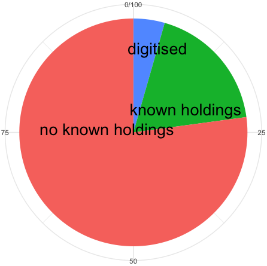
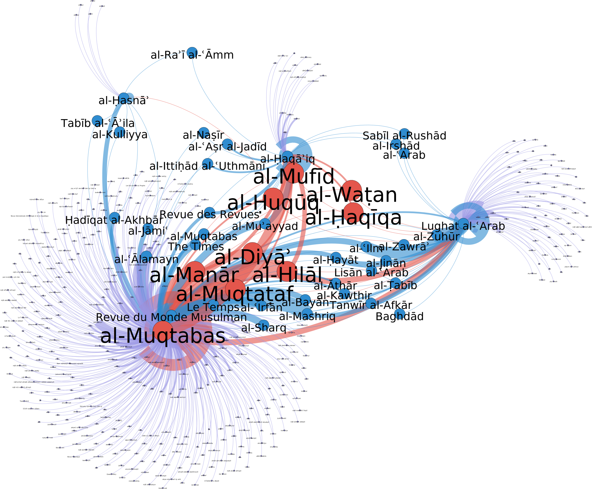

<!-- To do -->
<!-- - comments on collaborations -->


## Title slide

Till Grallert, Orient-Institut Beirut (OIB), @[tillgrallert](https://twitter.com/tillgrallert)

Probevortrag

Slides: [https://tillgrallert.github.io/slides/dh/2021-mind-the-gap](https://tillgrallert.github.io/slides/dh/2021-mind-the-gap/index.html)

## Übersicht des Probevortrages

1. Digitalität als egalitäres Versprechen
2. Digitalität als extreme Ungleichheit
3. Meine Ansätze um diese zu Addressieren
4. Meine analytischen Ansätze

# 1. Digitalität als egalitäres Versprechen
# 2. Digitalität als extreme Ungleichheit
# 3. Meine Ansätze um diese zu Addressieren
## Project Jarāʾid

- Addressiert den **knowledge gap** mit einer Webseite und offenen Datensätzen (TEI XML).
- Bibliographische Erfassung sämtlicher arabischer Periodika seit ihrer Entstehung um 1800 bis 1930.
    + Normdatensätze für c.2700 Personen, 220 Orte, 180 Bibliotheken u.ä.
- Kollaboration mit Adam Mestyan (Duke)

## Project Jarāʾid

:::{.c_width-50 .c_right}

:::

:::{.c_width-50 .c.left}

|                  | number  | %     |
| ---------------- | ------: | ----: |
| Periodika        | 3269    |       |
| in Bibliotheken  | 747     | 22.85 |
| digitalisiert    | 145     | 4.44  |

Table: In Project Jarāʾid erfasste Periodika
:::

## Open Arabic Periodical Editions (OpenArabicPE)
## OCR/HTR für arabische Periodika

# 4. Meine analytischen Ansätze
# 4.1 Netzwerkanalyse
# 4.1.1 Evaluierung des Korpus: Netzwerk der erwähnten Periodika
## Netzwerk der erwähnten Periodika: Datenquelle

:::{.c_width-50 .c_left}

- Auszeichnung aller Erwähnungen von Periodika im Text
    + semi-automatisch (regex): folgt dem Muster "Zeitung ABC", "Zeitschrift DEF"
- Normdatensätze für die Disambiguierung und Anreicherung von Daten
    + zumeist automisch erstellt und verknüpft

:::
:::{.c_width-50 .c_right}

```xml
والأصح الدرعية بلام التعريف (راجع <bibl subtype="journal" type="periodical">مجلة <title level="j" ref="oape:bibl:3 oclc:1034545644" xml:id="title_16.d2e2291">الزهور</title> المصرية  <biblScope unit="volume" from="2" to="2">٢</biblScope> :  <biblScope unit="page" from="292">٢٩٢</biblScope></bibl>)
```

```xml
وانتخب <persName>فؤاد أفندي الدفتري البغدادي</persName> و<bibl><editor><persName>نوري أفندي</persName></editor> راس كتاب <textLang otherLangs="ota">القسم التركي</textLang> في <bibl type="periodical" subtype="newspaper">جريدة <title ref="oape:bibl:532">الزهور</title></bibl> البغدادية</bibl> نائبين عن <placeName ref="oape:place:372 geon:94824">كربلاء</placeName>.
```

:::

## Netzwerk der erwähnten Periodika

:::{.c_width-60 .c_left}



:::
:::{.c_width-30 .c_right}

1. only a few nodes are of relative importance (44 of 465)
2. *al-Muqtabas* accounts for the vast majority of references
3. all periodicals are primarly self-referential

:::

## network of referenced periodicals: the core

:::{.c_width-60 .c_left}


:::

<!-- ## network of referenced periodicals -->

:::{.c_width-30 .c_right}

1. confirms the bias on Cairo and Beirut (8 of 9)
2. highly centralised in terms of geographic distribution (10 locations)
3. surprising members

:::

# Bibliometrics: the network of authors
## network of authors: data sources

:::{.c_width-50 .c_left}
- structured bibliographic data provided by the text itself
    + semi-automatic
    + problems: many accronyms, plurality of name forms
- authority files for disambiguation and additional information
- automatic enriching: from semantic web
    + life dates
    + works
    + geocoded locations

:::
:::{.c_width-50 .c_right}

```xml
<person>
    <persName><roleName type="pseudonym">ساتسنا</roleName></persName>
    <persName><roleName type="pseudonym">أمكح</roleName></persName>
    <persName><roleName type="pseudonym">فهر الجابري</roleName></persName>
    <persName><roleName type="rank">الأب</roleName> <forename>أنستاس</forename> <forename>ماري</forename> <surname><addName type="nisbah">الكرملي</addName></surname></persName>
    <persName><forename>أنستاس</forename> <forename>ماري</forename> <addName type="nisbah">الألياوي</addName> <surname><addName type="nisbah">الكرملي</addName></surname></persName>
    <persName><forename>بطرس</forename> <addName type="nasab">بن <forename>جبرائيل</forename></addName> <forename>يوسف</forename> <surname>عواد</surname></persName>
    <idno type="VIAF">39370998</idno>
    <idno type="oape">227</idno>
    <idno type="wiki">Q4751824</idno>
    <birth><date source="viaf" when="1866-08-05">1866-08-05</date> in <placeName ref="oape:place:216 geon:98182">Baghdad</placeName></birth>
    <death><date source="viaf" when="1947-01-07">1947-01-07</date> in <placeName ref="oape:place:216 geon:98182">Baghdad</placeName></death>
</person>
```

:::

## network of authors

:::{.c_width-60 .c_left}


:::
:::{.c_width-30 .c_right}

1. only a few nodes are of relative importance
2. limited overlap between journals from the same city
3. nodes are connected by various other social networks (education, imperial service, family relations etc.)

:::

## network of authors: the core

:::{.c_width-60 .c_left}


:::
:::{.c_width-30 .c_right}

1. many Iraqis
2. few Syrians
3. few Christians
2. many poets
3. majority not covered by scholarly literature

:::

## network of authors: geography

:::{.c_width-50 .c_left}


:::
:::{.c_width-50 .c_right}


:::
:::{.c_width-50 .c_left}


:::
:::{.c_width-50 .c_right}


:::

## Stilometrische Autorenschaftbestimmung
## Layoutanalyse