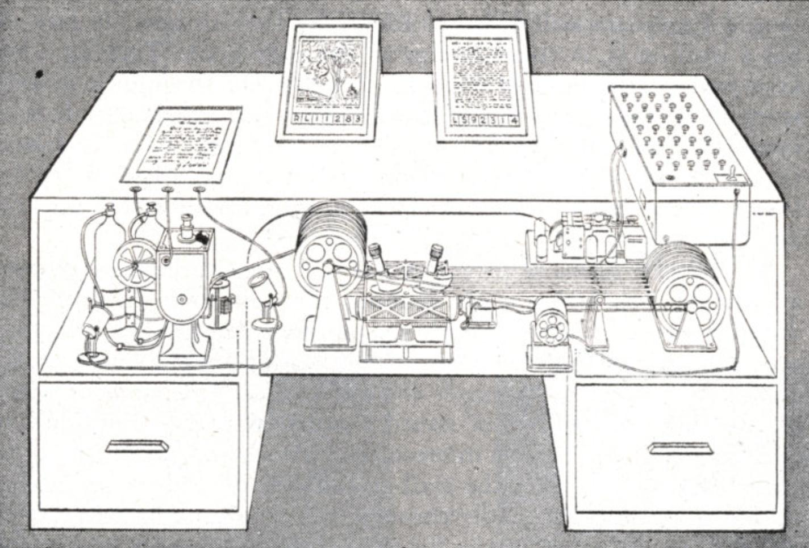
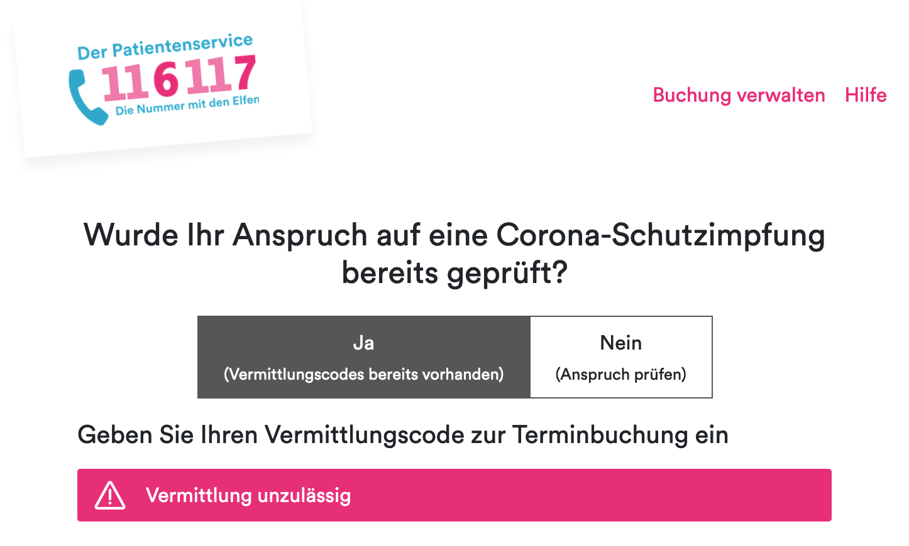
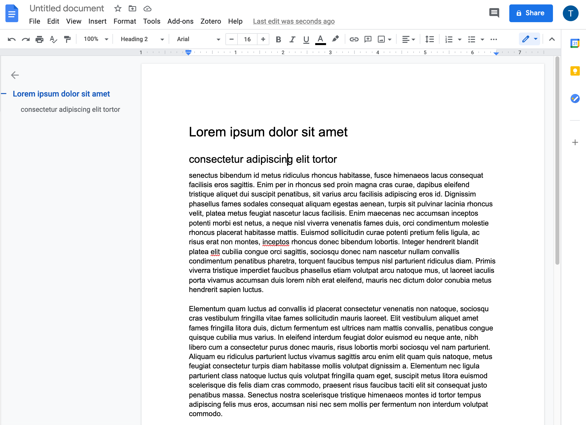
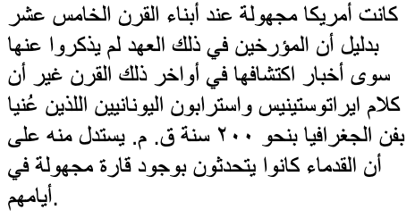

## Mind the `<gap/>`! <br/>Digital Humanities und das kulturelle Erbe des Globalen Südens

Till Grallert, Orient-Institut Beirut (OIB), @[tillgrallert](https://twitter.com/tillgrallert)

Probevortrag für "Qualifikationsprofessur für Digital Humanities (Akademieprofessur)"

4 März 2021

Folien: [https://tillgrallert.github.io/slides/dh/2021-mind-the-gap](https://tillgrallert.github.io/slides/dh/2021-mind-the-gap/index.html)

<!-- ## Übersicht des Probevortrages

1. Mind the `<gap/>`!
2. Closing the `<gap/>` one step at the time -->

# 1. Mind the `<gap/>`! <br/>Digitalität zwischen Heilsversprechen und Realität
## Digitalität zwischen Heilsversprechen und Realität

::: {.c_width-50}

### egalitäres Heilsversprechen

- jede kann ohne Unterschied teilhaben
- uneingescheränkter Zugang zum Wissen der Welt

### Normative Grundlagen

- Wissen = Daten = Verständnis
- mehr Wissen = besseres Verständnis
- Solutionism/Technokratie

:::
::: {.c_width-50}

{#fig:memex}

:::

## Digitalität zwischen Heilsversprechen und Realität

::: {.c_width-50}

{#fig:vaccination}

:::
::: {.c_width-50}

### ernüchternde Realtität

- universale, wenn auch unterschiedliche Ausschlußerfahrungen

### Elefant in the room

- Digitalität wird als **voraussetzungslos** verstanden

:::

## Digitalität als vorausetzungslos?
### Metaphermaschinen

::: {.c_width-50 .c_right}

- Digitalität **simuliert** Stasis und Vertrautheit
    + Metaphern
    + semantische Modelle
- Digitalität ist hochgradig ephemer und wird kontinuierlich remediiert

:::
::: {.c_width-50 .c_left}

{#fig:google-docs}

:::

## Mind the `<gap/>`! Zugangsvorraussetzungen

...  müssen explizit gemacht werden!

::: {.c_width-50}

### technisch

+ Hardware: aktuell
+ Strom: kontinuierlich
+ Internet: schnell und stabil
+ Software

:::
::: {.c_width-50}

### kulturell

+ Sprach- und Schriftkenntnisse
+ Vertrautheit mit den Metaphern
+ Vertrautheit mit semantischen Modellen

:::

## Mind the `<gap/>`! <br/>Zwischen Globalem Norden und Globalem Süden

::: {.c_width-50}

### Globaler Norden

- Hegemon
- Autor der technischen und kulturellen Standards der Digitalität

:::
::: {.c_width-50}

### Globaler Süden

- nicht homogen, kein universeller "Anderer"
- Vielzahl heterogener Regionalitäten
- gemeinsame Erfahrung der konstanten Auseinandersetzung mit dem Hegemon

:::

## Mind the `<gap/>`! <br/>Zwischen Globalem Norden und Globalem Süden
### Beispiel Libanon


- Hardware
    + Internetcafé
    + Telefon
- Stromversorgung
    + mind. 3h/ Tag reg. Stromausfall
    + Generatorenabonnements
- Internetverbindung
    + 15 Mbps für ein Institut mit 20-40 Nutzer_innen
    + mobil: 60 USD für 20 GB


## Mind the `<gap/>`! Digital Humanities als Teil des Globalen Nordens

](../../assets/dh/map_dhcenters.png)


# 1.1 Mind the `<gap/>`! <br/>Nicht-lateinische Schriften und Sprachen des Globalen Südens
## Englischkenntnisse sind <!-- für die Teilhabe --> unabdingbar

:::{.c_width-50}

Englisch ist die Lingua Franca und Basis der technischen Infrastruktur

- Beispiel: CSS

```css
body {
    background: white;
    color: black;
}
```

- Beispiel: R

```R
library(tidyverse)
setwd("/path/to/folder/")
load("oape_stats.rda")
المجلات <- c("4770057679", "644997575", "472450345", "792756327")
المشار.اليها <- المشار.اليها %>%
    filter(source.id.oclc %in% المجلات)
write.table(المشار.اليها, file = "csv/oape_stats.csv", row.names = FALSE, quote = TRUE, sep = ",")
```

:::
:::{.c_width-50}

Schriften und Sprachen des Globalen Nordens sind der Hegemon der Interfaces

: Englisches Interface (gelb), Arabisch in deutscher Umschrift (lila), Deutsch (grün).](../../assets/OpenArabicPE/translatio_interface-languages_annotated.png){#fig:translatio-interface}

:::

## Arabisch

:::{.c_width-50}

### Schrift

- zweithäufigste Schrift <!-- nach lateinischer Schrift -->
    + aktuell für 14 Sprachen verwendet, u.a. Arabisch, Persisch, Urdu, Pashtu.
+ Schriftrichtung von rechts nach links
+ Buchstaben werden mehrheitlich in Schreibrichtung verbunden und ändern dabei ihre Form:  [ج جـ ـجـ ـج]{.c_rtl}
+ Präferenz für Ligaturen

:::
:::{.c_width-50}

### Sprache

+ fünfthäufigeste Sprache
    * eine von sechs Amtssprachen der UN
    + <!-- offizielle --> Amtssprache in 26 Ländern
    * \>420 Mio. Sprechende
+ liturgische Sprache des Islams mit 1,6 Mrd. Gläubigen

:::

](../../assets/dh/arabic-script_sample-annotated.png){#fig:arabic-sample}

## Arabisch in der Digitalität
### Zum großen Teil <!-- von der digitalen Infrastruktur --> nicht unterstützt

+ Zeichenkodierung lange Zeit nicht unterstützt
+ <!-- Notwendige --> Verbindungsformen der Buchstaben werden der Rendering Engine überlassen
    * Microsoft Office for Mac: 2015
    * ggplot(Plots in R): 2021
+ Abstraktion in Buchstaben <!-- / Gleichsetzung von Graphemen mit Buchstaben --> ist zumindest umstritten
    + Zeichkodierung kann die kulturelle Praxis der Schreibenden nicht abbilden
+ OCR ist nicht funktional

<!-- hello Java, I am looking at you! -->
<!-- add screenshot of tweet writing Arabic in Latin -->

## Erfassung: Buchstaben, Grapheme, Zeichkodierung
### Unicode ist nicht die Lösung aller Probleme

:::{.c_width-50}

<!-- - Vor Unicode lange Zeit gar nicht unterstützt -->
- Unicode: <!-- in Mountain View ansässiges --> Industriekonsortium und ein Standard <!-- mit US-Dominanz -->
    <!-- + Full members: Adobe, Apple, Facebook, Google, IBM, Microsoft, Netflix, SAP, Salesforce, **Sultanat von Oman** -->
- Idee: Trennung von Bedeutung und Form
- Probleme:
    - Kodierungung <!-- sind politische Entscheidungen und --> folgen Sprachen, nicht Schriften
    - inkonsistent
- OS, Browser etc. normalisieren die Varianz nicht.
<!-- - Notwendige Verbindungsformen der Buchstaben werden der Rendering Engine überlassen -->
- Folge: Volltextsuchen sind nicht aussagekräftig
    + 32 Arten "mekkanisch" (مكية) zu schreiben

:::
:::{.c_width-50}

<!-- {#fig:arabic-mecca-1} -->

)](../../assets/dh/arabic-script_unicode-example-wikidata_narrow.png){#fig:arabic-mecca-2 height="300px"}

:::

## Darstellung: basale Standards werden nicht unterstützt
### Beispiel 1: Werbung (Grafik- und Layout Programme)

:::{.c_width-50}

<!-- Nicht verbunden und von rechts nach links -->

](../../assets/dh/ErLBbWwVgAErjHy.jpg){#fig:arabic-fail-covid}

:::
:::{.c_width-50}

<!-- Korrektur -->

](../../assets/dh/ErO3qtUVkAEUAQ_.jpg){#fig:arabic-fail-covid-corrected}

:::

## Darstellung: basale Standards werden nicht unterstützt
### Beispiel 2: Webbrowser und HTML 5

Browser ignorieren das HTML5 Attribut `@lang` und stellen Arabisch linksbündig dar


:::{.c_width-50}
{#fig:arabic-fail-chrome}
:::

:::{.c_width-50}
{#fig:arabic-fail-firefox}
:::

# 1.2 Mind the `<gap/>`! <br/>Digitalisierung des Kulturerbes
## Digitalisierung des Kulturerbes

:::{.c_width-50}

### Erfassung

Digitalisierung ist **teuer**: public-private partnerships, private vendors

+ Findet primär im Globalen Norden statt
+ Kuratorische Entscheidungen
    + Sammlung
    + Katalogisierung
    + Digitalisierung
+ Technische Entscheidungen
    * Workflows, Modelle, Ontologien des Nordens
+ Wirtschaftliche Entscheidungen
    * Outsourcing

:::
:::{.c_width-50}

### Bereitsstellung

Platformen zur Maximierung des Gewinns

+ Proprietäre Interfaces
+ Datensilos ohne APIs
+ Bezahlschranken
+ geo-fencing

:::

## Digitalisierung des Kulturerbes

{#fig:map-global-holdings}

## Digitalisierung des Kulturerbes: Bezahlschranken und Geo-fencing

:::{.c_width-50}

 außerhalb der USA](../../assets/OpenArabicPE/hathi_muqtabas-1.png){#fig:hathi-muqtabas-global}

:::
:::{.c_width-50}

 mit US IP](../../assets/OpenArabicPE/hathi_muqtabas-2.png){#fig:hathi-muqtabas-us}

:::

<!-- hier muss noch was zu den verschiedenen Gaps hin -->

<!-- ## Mind the `<gap/>`

- Infrastruktur
- Werkzeuge
- Wissen
 -->
# 2. Closing the `<gap/>`
## 2. Closing the `<gap/>`

:::{.c_width-30}

### Anliegen

- Digitale Erschließung von Kulturerbe des Globalen Südens
- Erforschung dieses Kulturerbes mit Methoden der DH

:::
:::{.c_width-60}

### Gegenstand

- Primär arabisch-sprachige Presse des spätosmanischen östlichen Mittelmeerraumes (c.1800 -- c.1920)
<!-- - Presse ist zentraler Agent des Wandels in der Moderne -->
- Presse bisher vor allem als Quelle genutzt und kaum als Gegenstand untersucht
- Forschung wird dominiert von
    + national(istisch)en Narrativen
    + Verengung auf zwei Orte und wenige <!-- allgemein zugängliche --> Titel
    + impliziten Hypothesen

:::

<!-- {#fig:muqtabas-cover} -->

{#fig:front-pages}

# 2.1 Closing the `<gap/>` <br/>Digitale Erschließung von Kulturerbe des Globalen Südens

## [Project Jarāʾid](https://projectjaraid.github.io/) (2012--) <br/>Closing the knowledge `<gap/>`

:::{.c_width-50}

- Bibliographische Erfassung sämtlicher arabisch-sprachiger Periodika weltweit seit ihrer Entstehung um 1800 bis 1929.
    + Webseite und offene Datensätze ([TEI XML](https://tei-c.org/))
    + Normdatensätze für c.2700 Personen, 220 Orte, 180 Bibliotheken u.ä.
- Kollaboration mit Adam Mestyan (Duke), "Crowd"-Sourcing

:::
:::{.c_width-50}

{#fig:map-jaraid}

:::

## [Project Jarāʾid](https://projectjaraid.github.io/) <br/>Mind the `<gap/>`!
### Wissenslücke -> Digitalisierungslücke

:::{.c_width-50}

Arabische Periodika bis 1929 weltweit

- Arabisch: 420 Mio Sprechende
- 3269 Zeitungen und Zeitschriften
- davon knapp 1/4 (747) in Sammlungen lokalisiert
- davon wiederum knapp 1/5 (145) digitalisiert
- Bezahlschranken, geo-fencing


<!-- {#fig:jaraid-stats width="300"} -->

:::
:::{.c_width-50}

Zum Vergleich: "[Der Erste Weltkrieg im Spiegel hessischer Regionalzeitungen](https://hwk1.hebis.de)"

- Hessen: 6,2 Mio. Einwohner_innen
- 125 Zeitungen mit mehr als ½ Mio. Seiten
- Digitalisat: Faksimile und Volltext
- Offen zugänglich

:::

## Open Arabic Periodical Editions ([OpenArabicPE](https://openarabicpe.github.io), 2015--) <br/>Closing the infrastructural `<gap/>`

::: {.c_width-30}

### Ansatz

- Verbindung **vorhandener** Faksimiles und Transkriptionen in einem standardkonformen, offenen Format
- Scraping, Erzeugung, Validierung und Teilen von offenen bibliographischen Metadaten

:::
::: {.c_width-30}

### Ziele

- Validierung und Nutzbarmachung vorhandener Transkriptionen
- Aufbau einer offenen Infrastruktur von Modellen, Workflows, Normdatensätzen
- Unter den Bedingungen des Globalen Südens

:::
::: {.c_width-30}

### Prinzipien

- **Etablierte** Werkzeuge und Technologien
- **wenige**, **offene** und **einfache** Formate und Werkzeuge
- **kostenfreie** Platformen ohne lock-in

:::

## [OpenArabicPE](https://openarabicpe.github.io)
### Infrastruktur

:::{.c_width-50}

1. Digitale Editionen, Normdatensätze: [TEI XML](https://tei-c.org/).
1. Offene Lizenzen: [CC BY-SA 4.0](http://creativecommons.org/licenses/by-sa/4.0/) (TEI, MODS, BibTeX), MIT license (XSLT, XQuery)
2. Soziale digitale Editionen, die auf [GitHub](https://github.com/openarabicpe) gehostet sind: <!-- gradually improve transcription and mark-up -->
2. Archivierung auf [Zenodo](https://zenodo.org): DOI für dauerhafte Referenzierbarkeit
3. [Statische Webansichten](https://github.com/openarabicpe/tei-boilerplate-arabic-editions)<!--  (doesn't require a permanent internet connection) -->: Parallele Darstellung von Text und Faksimile.
4. Bibliographische Metadaten sind als öffentliche [Zotero-Gruppe](https://www.zotero.org/groups/openarabicpe) gehostet

:::
:::{.c_width-50}

](../../assets/OpenArabicPE/boilerplate_muqtabas.png){#fig:webview-muqtabas}

:::

## OpenArabicPE
### Korpus

| Periodikum                                                                    | DOI                                                              | Bände | Ausgaben | Artikel | Wörter  |
| :--------                                                                     | :--                                                              | ----: | ----:    | ----:   | ----:   |
| [al-Ḥaqāʾiq](https://www.github.com/openarabicpe/digital-haqaiq)              | [10.5281/zenodo.1232016](https://doi.org/10.5281/zenodo.1232016) | 3     | 35       | 389     | 298090  |
| [al-Ḥasnāʾ](https://www.github.com/openarabicpe/journal_al-hasna)             | [10.5281/zenodo.3556246](https://doi.org/10.5281/zenodo.3556246) | 1     | 12       | 201     | NA      |
| [al-Manār](https://www.github.com/openarabicpe/journal_al-manar)              |                                                                  | 35    | 537      | 4300    | 6144593 |
| [al-Muqtabas](https://www.github.com/tillgrallert/digital-muqtabas)           | [10.5281/zenodo.597319](https://doi.org/10.5281/zenodo.597319)   | 9     | 96       | 2964    | 1981081 |
| [al-Ustādh](https://www.github.com/openarabicpe/journal_al-ustadh)            | [10.5281/zenodo.3581028](https://doi.org/10.5281/zenodo.3581028) | 1     | 42       | 435     | 221447  |
| [al-Zuhūr](https://www.github.com/openarabicpe/journal_al-zuhur)              | [10.5281/zenodo.3580606](https://doi.org/10.5281/zenodo.3580606) | 4     | 39       | 436     | 292333  |
| [Lughat al-ʿArab](https://www.github.com/openarabicpe/journal_lughat-al-arab) | [10.5281/zenodo.3514384](https://doi.org/10.5281/zenodo.3514384) | 3     | 34       | 939     | 373832  |
| **total**                                                                     |                                                                  | 56    | 795      | 9664    | 9311376 |

<!-- Table: Übersicht über das Periodikakorpus {#tbl:openarabicpe-corpus} -->


## OCR/HTR für arabische Periodika (2019--) <br/> Closing the tool `<gap/>`

- Kollaboration mit Sinai Rusinek (Haifa)
- Ansatz:
    + Maschinelles Lernen
    + OpenArabicPE Korpus als Ground Truth
- Software: Transkribus, Tesseract 4
- Probleme:
    + Komplexes Layout von Periodikaseiten
    + Software nimmt Links-nach-rechts als Leserichtung an
    + Rechenintensiv

## OCR/HTR für arabische Periodika
### Ergebnisse mit Transkribus

| ID      | based on   | ground truth    | words   | lines  | epochs  | CER train  | CER validation        |
| ------- | ---------- | --------------- | ------: | -----: | ------: | ---------: | --------------:       |
| 15946   |            | *al-Ustādh*     | 192829  | 18732  | 200     | 2.01       | [**2.09**]{style="color:green;"} |
| 13864   |            | *al-Muqtabas*   | 11116   | 1013   | 200     | 0.07       | [**8.40**]{style="color:red;"}                  |

<!-- | 25211   | 15946      |                 | 5987    | 604    | 100     | 0.09       | 6.19                  | -->

### Klassisches / kommerzielles OCR

![Evaluierung von OCR Software für Arabisch, [@Alghamdi.Teahan+2017+ExperimentalEvaluationArabic, table IV]](../../assets/dh/arabic-ocr_alghamdi-2017-table-iv_annotated.png){#fig:alghamdi-2018-table-4}


# 2.2 Closing the `<gap/>` <br/>Erforschung dieses Kulturerbes mit Methoden der DH
# SIHAFA: Mapping the late Ottoman Ideosphere of the Eastern Mediterranean through Computational Approaches to its Periodical Press (2021?--)

## SIHAFA

:::{.c_width-30}

### Ziele:

+ systematische Erforschung der spätosmanischen arabischen Presse *at scale*
+ Entwicklung/Evaluation von digitalen Methoden
+ Hinterfragung etablierter Forschungsnarrative
+ Etablierung von "Arab Periodical Studies"

:::
:::{.c_width-30}

### Fragen

+ Wer sind die zentralen Akteure (Personen, Periodika) in diesem diskursiven Feld?
+ Wie sind Periodika produziert worden? Wie ist Autorenschaft zu denken?
+ Welche Rolle spielt *text reuse*? Wie reisten Texte, Themen, Genres?
+ Wie hat sich die Sprache der Moderne im multilingualen, imperialen Raum etabliert?

:::
:::{.c_width-30}

### Methoden

+ Netzwerkanalyse
+ stilometrische Autorenschaftbestimmung
+ historische GIS
+ Layoutanalyse
+ Topic modelling
+ Word embeddings

:::

## 1. Historisches GIS: Typologie der Periodika <!-- CUT -->

Hypothese: geographische Herkunft von Artikeln in einem Periodikum erlaubt Rückschlüsse über seine Bedeutung

:::{.c_width-30}

### trans-regional

{#fig:authors-muqtabas}

:::

:::{.c_width-30}

### regional

{#fig:authors-hasna}

:::
:::{.c_width-30}

### lokal

{#fig:authors-haqaiq}

:::


## Historisches GIS
### Voraussetzungen: Daten

:::{.c_width-50}

- Erste Quellen: OpenArabicPE
- Auszeichnung von Orten im modellierten Volltext
    + Autor_innenzeilen
    + Rezensionen
    + Probleme: kein funktionales arabisches NER
- Normdatensätze für die Disambiguierung und Anreicherung von Daten
    + Georeferenzierte Orte
    + Probleme: Mangel an historischen Ortsverzeichnissen (gazetteer)

:::
:::{.c_width-50}

```xml
 <byline>
    <placeName ref="oape:place:9 geon:268064">صيدا</placeName>
    <persName ref="oape:pers:2845">مريم زكا</persName>
</byline>
```

```xml
<place type="town" xml:id="place_9">
    <placeName type="simple">Saida</placeName>
    <placeName xml:lang="ar-Latn-x-ijmes">Ṣaydā</placeName>
    <placeName xml:lang="en">Sidon</placeName>
    <placeName xml:lang="ar">صيدا</placeName>
    <location>
        <geo>33.55751, 35.37148</geo>
    </location>
    <idno type="url">http://en.wikipedia.org/wiki/Sidon</idno>
    <idno type="geon">268064</idno>
    <idno type="oape">9</idno>
</place>
```

:::

## 2. Netzwerkanalyse: Autor_innen

:::{.c_width-50}

{#fig:network-authors}

:::
:::{.c_width-50}

### Ziel

- empirische überprüfung von Hypothesen
- Forschungsleitend für *close reading*

### Erste Ergebnisse

<!-- * Nur wenige Knoten sind von relativer Bedeutung (14 von 319) -->
* Sehr begrenzte Überschneidung zwischen Periodika aus der gleichen Stadt
* Kernnetzwerk:
    - praktisch nicht in der Forschung abgebildet
    - Überraschende Zusammensetzung: viele Iraker (6), wenige Syrer (2), wenige Christen (2)

:::

## Netzwerkanalyse: Autor_innen
### Voraussetzungen: Daten

:::{.c_width-50}

- Erste Quellen: OpenArabicPE, Project Jarāʾid
- Strukturierte bibliographische Daten
    + semi-automatisch auf Basis der Editionen
    + manuelle Erfassung
    + Probleme: viele Abkürzungen, vielfältige Namensformen
- Normdatensätze für die Disambiguierung und Anreicherung von Daten
    + Lebensdaten
    + Werke in Bibliothekskatalogen
    + Probleme: geringe Quote in vorhandenen Normdatensätzen

:::
:::{.c_width-50}

```xml
<person>
    <persName><roleName type="pseudonym">ساتسنا</roleName></persName>
    <persName><roleName type="pseudonym">أمكح</roleName></persName>
    <persName><roleName type="pseudonym">فهر الجابري</roleName></persName>
    <persName><roleName type="rank">الأب</roleName> <forename>أنستاس</forename> <forename>ماري</forename> <surname><addName type="nisbah">الكرملي</addName></surname></persName>
    <persName><forename>أنستاس</forename> <forename>ماري</forename> <addName type="nisbah">الألياوي</addName> <surname><addName type="nisbah">الكرملي</addName></surname></persName>
    <persName><forename>بطرس</forename> <addName type="nasab">بن <forename>جبرائيل</forename></addName> <forename>يوسف</forename> <surname>عواد</surname></persName>
    <idno type="VIAF">39370998</idno>
    <idno type="oape">227</idno>
    <idno type="wiki">Q4751824</idno>
    <birth><date source="viaf" when="1866-08-05">1866-08-05</date> in <placeName ref="oape:place:216 geon:98182">Baghdad</placeName></birth>
    <death><date source="viaf" when="1947-01-07">1947-01-07</date> in <placeName ref="oape:place:216 geon:98182">Baghdad</placeName></death>
</person>
```

:::

## Problem: Das Netzwerk der Autor_innen umfasst nur 17% aller Artikel
:::{.c_width-30}

{width="100%" height="100%"}

:::
:::{.c_width-30}

### Forschungsstand

- Die Frage der Autorenschaftsbestimmung ist weitgehend ignoriert worden  <!-- standard accounts don't even mention the issue -->
- Implizite und häufig angenommene Hypothese: die Herausgeber_innen haben alle anonymen Artikel selbst geschrieben

:::
:::{.c_width-30}

### Probleme

- Hypothese ist nicht überprüft
- Wir kennen gar nicht die Namen aller potentiellen Kandidat_innen <!-- (siehe Project Jarāʾid) -->
- Es ist sehr unwahrscheinlich, dass alles von einer Person verfasst wurde <!-- Autor als Funktion, nicht als Person zu denken -->

:::

## 3. Stilometrie zur Autorenschaftsbestimmung

- **komparative** Methode:
    + Vergleich **stylistischer Merkmale** (*most frequent words* MFWs) liefert ein nummerisches Abstandsmaß (Verschiedenheit)
    + Selbstvalidierung: Abstimmung der Ergebnisse mehrerer Iterationen mit verschiedenen Anzahlen von MFWs
- Ist bis jetzt nicht auf arabische Texte angewendet worden
- Herausvorderungen:
    + abhängig von der Zusammensetzung des Korpus
    + Texte müssen eine Mindestlänge haben

## Stilometrie: erste Experimente
### Falsifizierung der Hypothese

:::{.c_width-60 .c_left}

{#fig:stylometry-muqtabas-w5000}

<!-- modularity group: members of the group have more connections among themselves than with other (groups of) nodes -->

:::
:::{.c_width-30}

- Stilometrie funktioniert für arabische Periodika
- <!-- Erfolgreich identifizierte  -->Signale für
    + Autorenschaft
    + Herausgeberschaft
    + Übersetzung
- Zusätzliches (Sub)-signal
    + Genre
<!-- - Falsifizierung der Hypothese: es gibt einen anonymen Autor, der nicht der Herausgeber ist -->

:::

<!-- - chunking/sampling beeinflusst die Ergebnisse
    + Anzahl der stylistische Merkmale: mehrere Iterationen stimmen ab
    + Textlänge: Minimum von 4000-5000 Wörtern für signifikante Ergebnisse -->


# Schlußbemerkungen <br/>Mind the `<gap/>`!
## Mind the `<gap/>`!

:::{.c_width-50}

- bei Forschung/Lehre zu Digitalität
- bei digitaler Forschung/Lehre
- beim Aufbau von Infrastrukturen
- beim Forschungsdatenmanagement
- ...

:::
:::{.c_width-50}

](../../assets/dh/Evc9uxzXEAE8GFw.jpg)
:::

## Danke!

- Beiträger_innen zu Project Jarāʾid: Hala Auji, Philippe Chevrant, Marina Demetriadou, Lamia Eid, Stacy Fahrenthold, Ulrike Freitag, <!-- Till Grallert,  -->Rana Issa, Nicole Khayat, Peter Magierski, Leyla von Mende, Adam Mestyan, Christian Meier, Daniel Newman, Geoffrey Roper, Sinai Rusinek, Philip Sadgrove, Ola Seif, and Rogier Visser
- Beiträger_innen zu OpenArabicPE: Jasper Bernhofer, Dimitar Dragnev, Patrick Funk, Talha Güzel, Hans Magne Jaatun, Xaver Kretzschmar, Daniel Lloyd, Klara Mayer, Tobias Sick, Manzi Tanna-Händel, and Layla Youssef
- Beiträger_innen zu OCR: Adam Mestyan, Sinai Rusinek
