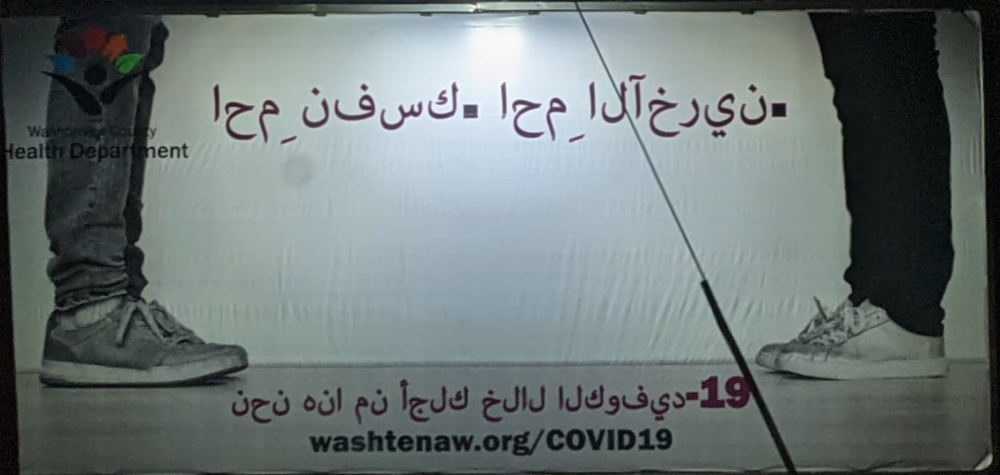
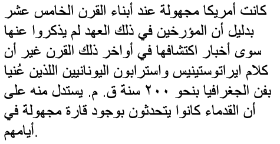
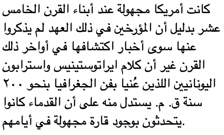
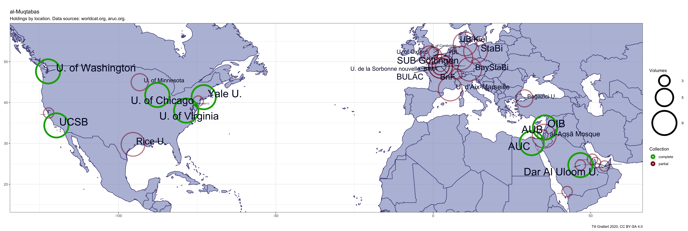
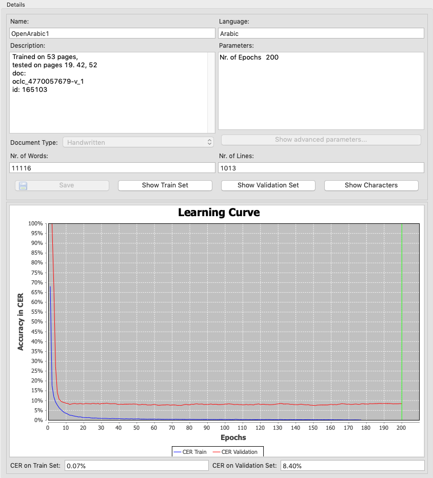
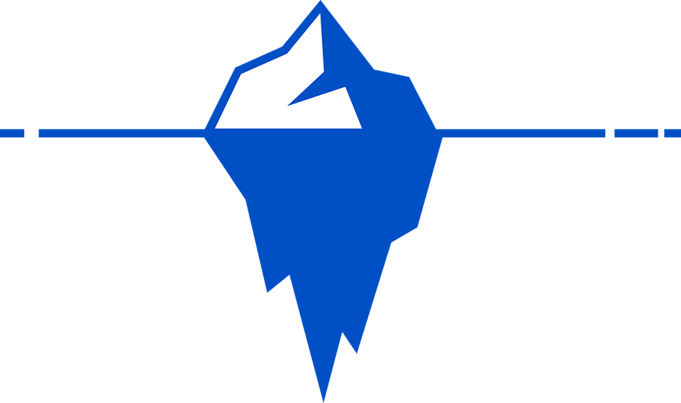

## Title slide

Till Grallert, Orient-Institut Beirut (OIB), @[tillgrallert](https://twitter.com/tillgrallert)

Probevortrag

Slides: [https://tillgrallert.github.io/slides/dh/2021-mind-the-gap](https://tillgrallert.github.io/slides/dh/2021-mind-the-gap/index.html)

## Übersicht des Probevortrages

1. Digitalität als egalitäres Versprechen
2. Digitalität als extreme Ungleichheit
3. Meine Ansätze um diese zu Addressieren
4. Meine analytischen Ansätze

# 1. Digitalität als egalitäres Versprechen
# 2. Digitalität als extreme Ungleichheit
# Basis: Technische Infrastrukturen
## Technische Infrastrukturen
### Ungleicher Zugang nach Geographie, Gender, Besitz

<!-- - Computer Hardware: aktuell?
    + Gar keinen privaten Zugang
    + Über ein Telefon
- Stromversorgung: stabil?
    + 2018: 89,6%
    + Afrika: 20 Länder unter 43%
- Internetverbindung: stabil und schnell?
    + 2019: knapp 4 Mrd. Menschen (c.51,4 %)
- Software
    + Trend zu Abo-Modellen für die Erstellung von Inhalten -->

+--------------------+------------------------------------------+--------------------------------+
|                    |                 Weltweit                 |            Libanon             |
+====================+==========================================+================================+
| Computer Hardware  | - Internetcafé                           |                                |
|                    | - Telefon                                |                                |
+--------------------+------------------------------------------+--------------------------------+
| Stomversorgung     | + 2018: 89,6%                            | - 3h/ Tag reg. Stromausfall    |
|                    | + Afrika: 20 Länder unter 43%            | - teure Generatorenabonnements |
+--------------------+------------------------------------------+--------------------------------+
| Internetverbindung | + 2019: knapp 4 Mrd. Menschen (c.51,4 %) | - 15 Mbps für ein Institut     |
|                    |                                          | - mobil: 60 USD für 20 GB      |
+--------------------+------------------------------------------+--------------------------------+
| Software           | + Trend zu Abo-Modellen                  |                                |
+--------------------+------------------------------------------+--------------------------------+


<!-- 40 MB für einen Scan dauern mit 15 Mbps rechnerisch 21,33 Sek für den Download. Aber über VPN oder vor Ort teilen sich diese Leitung 20-40 Leute -->
<!-- außerdem fliege ich alle 200-300 MB aus dem SharePoint Volume -->

# Nicht-lateinische Schriften und Sprachen des Globalen Südens
## Ungleicher Zugang nach Sprache

### Englischkenntnisse sind <!-- für die Teilhabe --> unabdingbar

:::{.c_width-50 .c_left}

Englisch ist die Lingua Franca und Basis der technischen Infrastruktur

- Beispiel: CSS

```css
body {
    background: white;
    color: black;
}
```

- Beispiel: R

```R
library(tidyverse)
setwd("/path/to/folder/")
load("oape_stats.rda")
المجلات <- c("4770057679", "644997575", "472450345", "792756327")
المشار.اليها <- المشار.اليها %>%
    filter(source.id.oclc %in% المجلات)
write.table(المشار.اليها, file = "csv/oape_stats.csv", row.names = FALSE, quote = TRUE, sep = ",")
```

:::
:::{.c_width-50 .c_right}

Schriften und Sprachen des Globalen Nordens sind der Hegemon der Interfaces

: Englisches Interface (gelb), Arabisch in deutscher Umschrift (lila), Deutsch (grün).](../../assets/OpenArabicPE/translatio_interface-languages_annotated.png){#fig:translatio-interface}

:::

## Arabisch

:::{.c_width-50 .c_left}

### Schrift

- zweithäufigste Schrift <!-- nach lateinischer Schrift -->
+ aktuell für 14 Sprachen verwendet, u.a. Arabisch, Persisch, Urdu, Pashtu.
+ Schriftrichtung von rechts nach links
+ Buchstaben werden mehrheitlich in Schreibrichtung verbunden und ändern dabei ihre Form:  [ج جـ ـجـ ـج]{.c_rtl}
+ Präferenz für Ligaturen

:::
:::{.c_width-50 .c_right}

### Sprache

+ fünfthäufigeste Sprache
    * eine von sechs Amtssprachen der UN
    + <!-- offizielle --> Amtssprache in 26 Ländern
    * \>420 Mio. Sprechende
+ liturgische Sprache des Islams mit 1,6 Mrd. Gläubigen

:::

](../../assets/dh/arabic-script_sample-annotated.png){#fig:arabic-sample}

## Arabisch in der Digitalität

Arabisch wird zum großen Teil von der digitalen Infrastruktur nicht unterstützt

+ Character encoding kann die kulturelle Praxis der Schreibenden nicht abbilden
+ Abstraktion in Buchstaben / Gleichsetzung von Graphemen mit Buchstaben ist zumindest umstritten
+ Die notwendigen Verbindungsformen der Buchstaben werden der Rendering Engine überlassen
+ OCR ist nicht funktional

<!-- add screenshot of tweet writing Arabic in Latin -->

## Arabische Schrift: Character encoding

:::{.c_width-50 .c_left}

- Vor Unicode lange Zeit gar nicht unterstützt
- Unicode ist ein in Mountain View ansässiges Industriekonsortium <!-- mit US-Dominanz -->
    + Full members: Adobe, Apple, Facebook, Google, IBM, Microsoft, Netflix, SAP, Salesforce, *Sultanat von Oman*
- Encodings sind politische Entscheidungen und folgen Sprachen, nicht Schriften
- OS, Browser etc. normalisieren die Varianz nicht.
- Folge: Volltextsuchen sind nicht aussagekräftig

:::
:::{.c_width-50 .c_right}

{#fig:arabic-mecca-1}

)](../../assets/dh/arabic-script_unicode-example-wikidata_narrow.png){#fig:arabic-mecca-2 height="300px"}

:::

## Rendering: basale Standards werden nicht unterstützt

### Beispiel 1: Werbung (Grafik- und Layout Programme)

:::{.c_width-50 .c_left}

<!-- Nicht verbunden und von rechts nach links -->

{#fig:arabic-fail-covid}

:::
:::{.c_width-50 .c_right}

<!-- Korrektur -->

{#fig:arabic-fail-covid-corrected}

:::

<!--    -->

## Rendering: basale Standards werden nicht unterstützt
### Beispiel 2: Webbrowser und HTML 5

Das browsereigene CSS ignoriert das HTML5 Attribut `@lang` und stellt Arabisch linksbündig dar

:::{lang="ar"}
كانت أمريكا مجهولة عند أبناء القرن الخامس عشر بدليل أن المؤرخين في ذلك العهد لم يذكروا عنها سوى أخبار اكتشافها في أواخر ذلك القرن غير أن كلام ايراتوستينيس واسترابون اليونانيين اللذين عُنيا بفن الجغرافيا بنحو ٢٠٠ سنة ق. م. يستدل منه على أن القدماء كانوا يتحدثون بوجود قارة مجهولة في أيامهم.
:::

:::{.c_width-30}
{#fig:arabic-fail-chrome}
:::

:::{.c_width-30}
{#fig:arabic-fail-firefox}
:::

:::{.c_width-30}
{#fig:arabic-fail-safari}
:::

# Digitalisierung des Kulturerbes
## Digitalisierung des Kulturerbes

:::{.c_width-50 .c_left}

### Erfassung

Digitalisierung ist **teuer**: public-private partnerships, private vendors

+ Findet primär im Globalen Norden statt
+ Kuratorische Entscheidungen
    + Sammlung
    + Katalogisierung
    + Digitalisierung
+ Technische Entscheidungen
    * Workflows, Modelle, Ontologien des Nordens
+ Wirtschaftliche Entscheidungen
    * Outsourcing

:::
:::{.c_width-50 .c_right}

### Bereitsstellung

Platformen zur Maximierung des Gewinns

+ Proprietäre Interfaces
+ Datensilos ohne APIs
+ Bezahlschranken
+ geo-fencing

:::

## Digitalisierung des Kulturerbes

{#fig:map-global-holdings}

## Digitalisierung des Kulturerbes: Bezahlschranken und Geo-fencing

:::{.c_width-50 .c_left}

 außerhalb der USA](../../assets/OpenArabicPE/hathi_muqtabas-1.png){#fig:hathi-muqtabas-global}

:::
:::{.c_width-50 .c_right}

 mit US IP](../../assets/OpenArabicPE/hathi_muqtabas-2.png){#fig:hathi-muqtabas-us}

:::

## Digitalisierung des Kulturerbes: OCR Schichten

:::{.c_width-50 .c_left}

 (mit US IP)](../../assets/OpenArabicPE/hathi_muqtabas-ocr-3.png)

:::
:::{.c_width-50 .c_right}

](../../assets/OpenArabicPE/gpa_bashir-i_487-p_1_ocr.png)

:::


<!-- hier muss noch was zu den verscheidenen Gaps hin -->

# 3. Closing the `<gap/>`: mein Beitrag zu den *digital commons*
# 3.1 Wissenslücke/ knowledge gap: Project Jarāʾid (2012--)
## [Project Jarāʾid](https://projectjaraid.github.io/)

<!-- - Addressiert den **knowledge gap** mit einer Webseite und offenen Datensätzen (TEI XML). -->

:::{.c_width-50 .c_left}

- Bibliographische Erfassung sämtlicher arabischer Periodika seit ihrer Entstehung um 1800 bis 1930.
    + Webseite und offene Datensätzen (TEI XML)
    + Normdatensätze für c.2700 Personen, 220 Orte, 180 Bibliotheken u.ä.
- Kollaboration mit Adam Mestyan (Duke)

:::
:::{.c_width-50 .c_right}

{#fig:map-jaraid}

:::

## [Project Jarāʾid](https://projectjaraid.github.io/)
### Wissenslücke -> Digitalisierungslücke

:::{.c_width-50 .c_right}
{#fig:jaraid-stats}
:::

:::{.c_width-50 .c_left}

|                  | number  | %     |
| ---------------- | ------: | ----: |
| Periodika        | 3269    |       |
| in Bibliotheken  | 747     | 22.85 |
| digitalisiert    | 145     | 4.44  |

<!-- Table: In Project Jarāʾid erfasste Periodika {#tbl:jaraid-stats} -->
:::

# 3.2 Infrastructural gap: Open Arabic Periodical Editions (OpenArabicPE, 2015--) <!-- digitisation bias  -->
## corpus building: [Open Arabic Periodical Editions](https://openarabicpe.github.io)

1. Ideen:
    - Verbindung **vorhandener** Faksimiles und Transkriptionen in einem standardkonformen, offenen Format
    - Scraping, Erzeugung, Validierung und Teilen von offenen bibliographischen Metadaten
2. Ziele
    + **Validierung** der Transkriptionen
    + Iterative und kollaborative **Verbesserungen** der Editionen
    + Alles soll dauerhaft **zitierbar** und **verlinkbar** sein
    + Verbesserte Zugänglichkeit und Nachnutzung durch **offene Lizenzen**
3. Prinzipien
    - Weiternutzung **vorhandener** und **etablierter** Werkzeuge und Technologien
    - Präferenz für **offene** und **einfache** Formate und Werkzeuge

## corpus building: [Open Arabic Periodical Editions](https://openarabicpe.github.io)

:::{.c_width-50 .c_left}

1. Digitale Editionen: TEI XML.
1. Offene Lizenzen: [CC BY-SA 4.0](http://creativecommons.org/licenses/by-sa/4.0/) (TEI, MODS, BibTeX), MIT license (XSLT, XQuery)
2. Soziale digitale Editionen, die auf [GitHub](https://github.com/openarabicpe) gehostet sind: <!-- gradually improve transcription and mark-up -->
2. Veröffentlichungen werden auf [Zenodo](https://zenodo.org) archiviert: DOI für dauerhafte Referenzierbarkeit
3. [Statische Webansichten](https://github.com/openarabicpe/tei-boilerplate-arabic-editions)<!--  (doesn't require a permanent internet connection) -->: Parallele Darstellung von Text und Faksimile.
4. Bibliographische Metadaten sind als öffentliche [Zotero-Gruppe](https://www.zotero.org/groups/openarabicpe) gehostet

:::
:::{.c_width-50 .c_right}

](../../assets/OpenArabicPE/boilerplate_muqtabas.png){#fig:webview-muqtabas}

:::

## OpenArabicPE: Korpus

| Periodikum                                                                        | DOI                                                              | Bände | Ausgaben | Artikel | Wörter   | Wörter/Artikel |
| :--------                                                                         | :--                                                              | ----: | ----:    | ----:    | ----:   | ----:             |
| [al-Ḥaqāʾiq](https://www.github.com/openarabicpe/digital-haqaiq)              | [10.5281/zenodo.1232016](https://doi.org/10.5281/zenodo.1232016) | 3     | 35       | 389      | 298090  | 832.66            |
| [al-Ḥasnāʾ](https://www.github.com/openarabicpe/journal_al-hasna)             | [10.5281/zenodo.3556246](https://doi.org/10.5281/zenodo.3556246) | 1     | 12       | 201      | NA      | NA                |
| [al-Manār](https://www.github.com/openarabicpe/journal_al-manar)                  |                                                                  | 35    | 537      | 4300     | 6144593 | 1437.73           |
| [al-Muqtabas](https://www.github.com/tillgrallert/digital-muqtabas)           | [10.5281/zenodo.597319](https://doi.org/10.5281/zenodo.597319)   | 9     | 96       | 2964     | 1981081 | 873.34            |
| [al-Ustādh](https://www.github.com/openarabicpe/journal_al-ustadh)                | [10.5281/zenodo.3581028](https://doi.org/10.5281/zenodo.3581028) | 1     | 42       | 435      | 221447  | 582.21            |
| [al-Zuhūr](https://www.github.com/openarabicpe/journal_al-zuhur)                  | [10.5281/zenodo.3580606](https://doi.org/10.5281/zenodo.3580606) | 4     | 39       | 436      | 292333  | 695.09            |
| [Lughat al-ʿArab](https://www.github.com/openarabicpe/journal_lughat-al-arab) | [10.5281/zenodo.3514384](https://doi.org/10.5281/zenodo.3514384) | 3     | 34       | 939      | 373832  | 485.21            |
| **total**                                                                         |                                                                  | 56    | 795      | 9664     | 9311376 |                   |

Table: Übersicht über das Periodikakorpus {#tbl:openarabicpe-corpus}


# 3.3 Tool gap: OCR/HTR für arabische Periodika (2019--)
## Traditionelle Ansätze

- Ziel: Buchstaben- und Worterkennung
- Ansatz: Segmentierung, Erkennung
- Probleme:
    + Buchstaben werden **mehrheitlich** in Schreibrichtung verbunden
    + Positionsabhängige Buchstabenformen
    + Ambivalente Buchstabenformen
    + Präferenz für Ligaturen 
- Resultat:

![Evaluierung von OCR Software für Arabisch, [@Alghamdi.Teahan+2017+ExperimentalEvaluationArabic, table IV]](../../assets/dh/arabic-ocr_alghamdi-2017-table-iv_annotated.png){#fig:alghamdi-2018-table-4}

## Neue Ansätze mit maschinellem Lernen

- Ansatz: Word spotting und Lernen
- Vorteile:
    + Segmentierung nicht notwendig
    + Eingabe- und Ausgabeschrift müssen nicht die gleiche sein
    + Offene Software
- Nachteile
    + Training benötigt potentiell sehr umfangreiches Ground Truth
    + Training von Schrift- und Sprachmodellen für jeden Font
    + Rechenintensiv

## Experiment: OCR für arabische Periodika

- Kollaboration mit Sinai Rusinek (Haifa)
- Software: Transkribus, Tesseract 4
- Ground Truth: OpenArabicPE Korpus
- Probleme:
    + Komplexes Layout
    + Software nimmt Links-nach-rechts als Leserichtung an
- Resultat:

| ID      | based on   | ground truth    | words   | lines  | epochs  | CER train  | CER validation  |
| ------- | ---------- | --------------- | ------: | -----: | ------: | ---------: | --------------: |
| 15946   |            | *al-Ustādh*     | 192829  | 18732  | 200     | 2.01       | 2.09            |
| 13864   |            | *al-Muqtabas*   | 11116   | 1013   | 200     | 0.07       | 8.40            |
| 25211   | 15946      |                 | 5987    | 604    | 100     | 0.09       | 6.19            |


## Experiment: Transkribus

:::{.c_width-50 .c_left}

{#fig:transkribus-evaluation}

:::
:::{.c_width-50 .c_right height="100%"}

{#fig:muqtabas-1-1-19}

:::


# 4. Closing the `<gap/>`: digitale Methoden
# SIHAFA: Mapping the late Ottoman Ideosphere of the Eastern Mediterranean through Computational Approaches to its Periodical Press (2021?--)
## SIHAFA

- Fragen
- Methoden

# 4.1 Netzwerkanalyse
## Netzwerk der erwähnten Periodika
### Datenquelle

:::{.c_width-50 .c_left}

- Auszeichnung aller Erwähnungen von Periodika im Text
    + semi-automatisch (regex): folgt dem Muster "Zeitung ABC", "Zeitschrift DEF"
- Normdatensätze für die Disambiguierung und Anreicherung von Daten
    + zumeist automatisch erstellt und verknüpft

:::
:::{.c_width-50 .c_right}
<!-- Zwei Ausschnitte, die verschiedene Periodika mit dem gleichen Titel (*al-Zuhūr*) erwähnen. -->

<!-- ägyptische Zeitschrift -->
```xml
والأصح الدرعية بلام التعريف (راجع <bibl subtype="journal" type="periodical">مجلة <title level="j" ref="oape:bibl:3 oclc:1034545644" xml:id="title_16.d2e2291">الزهور</title> المصرية  <biblScope unit="volume" from="2" to="2">٢</biblScope> :  <biblScope unit="page" from="292">٢٩٢</biblScope></bibl>)
```

<!-- irakische Zeitung -->
```xml
وانتخب <persName>فؤاد أفندي الدفتري البغدادي</persName> و<bibl><editor><persName>نوري أفندي</persName></editor> راس كتاب <textLang otherLangs="ota">القسم التركي</textLang> في <bibl type="periodical" subtype="newspaper">جريدة <title ref="oape:bibl:532">الزهور</title></bibl> البغدادية</bibl> نائبين عن <placeName ref="oape:place:372 geon:94824">كربلاء</placeName>.
```

:::

## Netzwerk der erwähnten Periodika

:::{.c_width-60 .c_left}

{#fig:network-periodicals}

:::
:::{.c_width-30 .c_right}

1. Nur wenige Knoten sind von relativer Bedeutung (44 von 465)
2. Alle Periodika sind hauptsächlich selbstreferentiell
2. *al-Muqtabas* ist anders
3. Kernnetzwerk:
    - Überraschende Mitglieder
    - Hochgradig geographisch konzentriert <!-- (10 Orte) -->
    - Bestätigt den Forschungsschwerpunkt auf Kairo und Beirut

:::

## 4.1.2 Bibliometrics: Netzwerk der Autor_innen
## Netzwerk der Autor_innen: Datenquellen

:::{.c_width-50 .c_left}

- Strukturierte bibliographische Daten auf Basis der Editionen
    + semi-automatisch
    + Probleme: viele Abkürzungen, vielfältige Namensformen
- Normdatensätze für die Disambiguierung und Anreicherung von Daten
    + Lebensdaten
    + Werke in Bibliothekskatalogen
    + Georeferenzierte Orte

:::
:::{.c_width-50 .c_right}

```xml
<person>
    <persName><roleName type="pseudonym">ساتسنا</roleName></persName>
    <persName><roleName type="pseudonym">أمكح</roleName></persName>
    <persName><roleName type="pseudonym">فهر الجابري</roleName></persName>
    <persName><roleName type="rank">الأب</roleName> <forename>أنستاس</forename> <forename>ماري</forename> <surname><addName type="nisbah">الكرملي</addName></surname></persName>
    <persName><forename>أنستاس</forename> <forename>ماري</forename> <addName type="nisbah">الألياوي</addName> <surname><addName type="nisbah">الكرملي</addName></surname></persName>
    <persName><forename>بطرس</forename> <addName type="nasab">بن <forename>جبرائيل</forename></addName> <forename>يوسف</forename> <surname>عواد</surname></persName>
    <idno type="VIAF">39370998</idno>
    <idno type="oape">227</idno>
    <idno type="wiki">Q4751824</idno>
    <birth><date source="viaf" when="1866-08-05">1866-08-05</date> in <placeName ref="oape:place:216 geon:98182">Baghdad</placeName></birth>
    <death><date source="viaf" when="1947-01-07">1947-01-07</date> in <placeName ref="oape:place:216 geon:98182">Baghdad</placeName></death>
</person>
```

:::

## Netzwerk der Autor_innen

:::{.c_width-60 .c_left}

{#fig:network-authors}

:::
:::{.c_width-30 .c_right}

1. Nur wenige Knoten sind von relativer Bedeutung (14 von 319)
2. Sehr begrenzte Überschneidung zwischen Periodika aus der gleichen Stadt
3. Kernnetzwerk:
    - Viele Iraker (6), wenige Syrer (2)
    - Wenige Christen (2)
    - Viele Dichter (7) und Journalisten (7)
    - praktisch nicht in der Literatur abgebildet

:::

# Geographische Netzwerke
## Netzwerk der Autor_innen: Geographie

:::{.c_width-50 .c_left}

{#fig:authors-muqtabas}

:::
:::{.c_width-50 .c_right}

{#fig:authors-haqaiq}

:::
:::{.c_width-50 .c_left}

{#fig:authors-hasna}

:::
:::{.c_width-50 .c_right}

{#fig:authors-lughat}

:::

## Problem: Das Netzwerk der Autor_innen umfasst nur 17% aller Artikel




# Stilometrische Autorenschaftsbestimmung
## Autorenschaftsbestimmung

:::{.c_width-50 .c_left}

### Forschungsstand

- Die Frage der Autorenschaftsbestimmung ist weitgehend ignoriert worden  <!-- standard accounts don't even mention the issue -->
- Implizite und häufig angenommene Hypothese: die Herausgeber_innen haben alle anonymen Artikel selbst geschrieben

:::
:::{.c_width-50 .c_right}

### Probleme

- Hypothese ist nicht überprüft
- Wir kennen gar nicht die Namen aller potentiellen Kandidat_innen (siehe Project Jarāʾid)
- Es ist sehr unwahrscheinlich, dass alles von einer Person verfasst wurde <!-- Autor als Funktion, nicht als Person zu denken -->

:::

## Computer-gestützte Autorenschaftsbestimmung: Stylometrie

- Ist bis jetzt nicht auf arabische Texte angewendet worden
- **komparative** Methode:
    + Vergleich **stylistischer Merkmale**: nummerisches Abstandsmaß (Verschiedenheit)
    + nummerisches Abstandsmaß ist abhängig von der Zusammensetzung des Korpus
- stylistische Merkmale: *most frequent words* (MFWs)
- chunking/sampling beeinflusst die Ergebnisse
    + Anzahl der stylistische Merkmale: mehrere Iterationen stimmen ab
    + Textlänge: Minimum von 4000-5000 Wörtern für signifikante Ergebnisse

## Stilometrie: erste Versuche
### Falsifizierung der Hypothese

:::{.c_width-60 .c_left}

{#fig:stylometry-muqtabas-w5000}

<!-- modularity group: members of the group have more connections among themselves than with other (groups of) nodes -->

:::
:::{.c_width-30 .c_right}

- Stilometrie funktioniert für arabische Periodika
- <!-- Erfolgreich identifizierte  -->Signale für
    + Autorenschaft
    + Herausgeberschaft
    + Übersetzung
- Zusätzliches (Sub)-signal: Genre
<!-- - Falsifizierung der Hypothese: es gibt einen anonymen Autor, der nicht der Herausgeber ist -->

:::

## Layoutanalyse